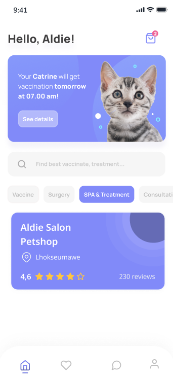
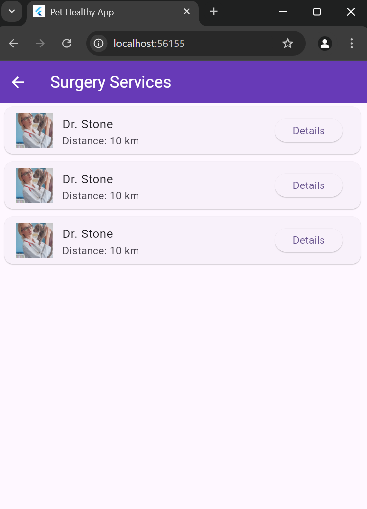
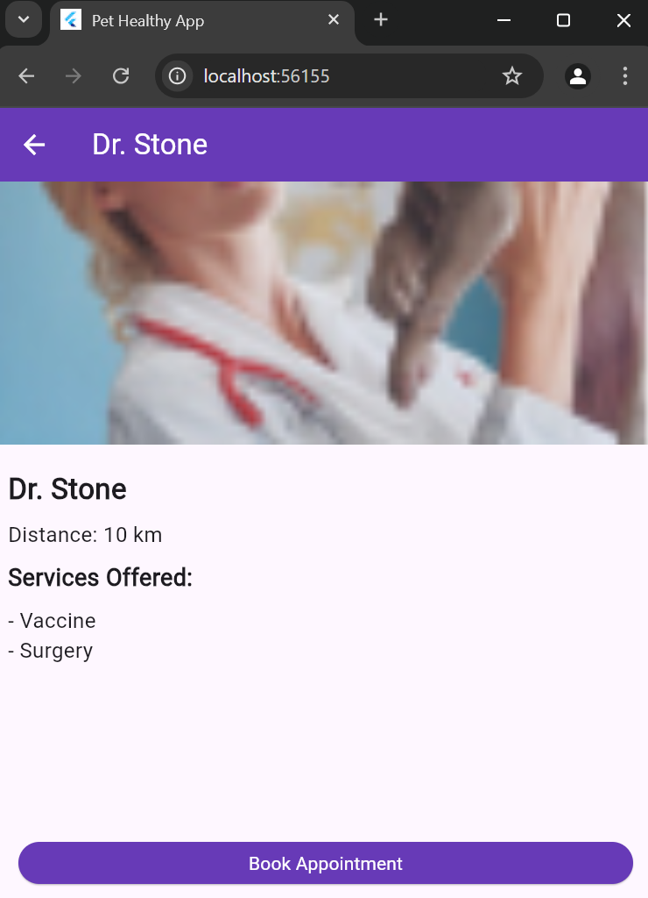

# Pet_Healthy_Kel_1

# Anggota Kelompok :

Ketua : - Agung Ramadhan Setiawan

Anggota : 
- Teuku Aldie Aulia
Halaman Spa & Treatment
Fungsi dari bagian **Rekomendasi SPA & Treatment** pada halaman ini adalah untuk memberikan informasi kepada pengguna mengenai tempat layanan perawatan dan relaksasi untuk hewan peliharaan yang direkomendasikan. 
Melalui informasi seperti nama tempat, lokasi, rating, dan ulasan pengguna lain, fitur ini membantu pengguna memilih layanan terbaik berdasarkan kebutuhan dan preferensi mereka. Dengan adanya ikon lokasi, pengguna juga dapat dengan mudah menemukan tempat tersebut menggunakan navigasi. Tujuannya adalah untuk mempermudah pemilik hewan peliharaan dalam menemukan layanan SPA & Treatment yang terpercaya dan berkualitas.

- Penempatan rekomendasi di bawah kategori "SPA & Treatment" menekankan layanan khusus perawatan dan relaksasi untuk hewan peliharaan.
- Informasi ini membantu pengguna membuat keputusan lebih baik dengan membandingkan kualitas layanan yang ditawarkan.
- Penyajian yang ringkas dan informatif mempermudah pengguna untuk langsung memahami informasi penting tanpa kebingungan.

- Afiifa Lhokseum Dwi Putri
Halaman Consultation
Halaman consultation pada aplikasi ini berfungsi untuk membawa pengguna ke layar dialog dengan dokter hewan yang dipilih.
Tombol ini menggunakan fitur navigasi Flutter ( Navigator.push) untuk berpindah ke layar ChatScreen , sekaligus mengirimkan nama dokter sebagai data untuk konteks percakapan.

- Pada halaman konsultation, terdapaan beberapaa pilihan dokter yang dapat melakukan consultation
- kemudian terdapat tombol buttom pada setiap disamping nama dokter yang dapat mengarahkan anda kedalam ruang chat bersama dokter yang telah anda pilih
  

- Pada halaman ini, anda telah berada di dalam ruang chat bersama dokter pilihan anda sebelum nya
- Anda dapat melakukan konsultasi mengenai hewan anda kepada sang-dokter
- kemudian anda dapat mengirimkan teks pesan anda dengan menekan tombol kirim yang berwarna biru disamping kanan bawah  

- Fachrul Rozi Rangkuti
Halaman SurgeryPage

- Halaman SurgeryPage ini berfungsi untuk menampilkan daftar dokter yang menyediakan layanan Surgery (operasi hewan). Halaman ini dirancang untuk memberikan tampilan bersih dan informatif dengan fokus pada daftar dokter layanan Surgery serta memungkinkan pengguna untuk melihat detail lebih lanjut tentang dokter tersebut.
- Data dokter diambil dari variabel doctors yang sudah difilter hanya dokter yang menyediakan layanan Surgery.
- Jika tidak ada dokter yang menyediakan layanan Surgery, ditampilkan pesan "No doctors found for Surgery service."

- Halaman DetailDoctorPage berfungsi untuk menampilkan detail lengkap dari seorang dokter yang dipilih oleh pengguna. Halaman ini menerima parameter DoctorModel doctor yang berisi data dokter seperti nama, gambar, jarak, dan layanan yang ditawarkan.
- Di bagian bawah halaman, terdapat tombol untuk melakukan pemesanan janji temu.
- Saat tombol ditekan, ditampilkan SnackBar yang memberi tahu bahwa fitur pemesanan akan segera hadir.

- Cut Siti Sarah Azkiani
- Halaman ProfilePage
Halaman profil pada aplikasi HealthyPet berfungsi sebagai pusat kendali utama bagi pengguna untuk mengelola informasi pribadi dan data hewan peliharaan mereka. Halaman ini menampilkan informasi pengguna seperti nama, email, dan foto profil, yang dapat diedit sesuai kebutuhan. Selain itu, pengguna dapat mengakses menu Hewan Peliharaan Saya untuk melihat, menambahkan, atau mengubah data hewan peliharaan, termasuk nama, usia, ras, jenis, dan foto. Menu Riwayat Kesehatan memungkinkan pengguna melacak jadwal vaksinasi, pemeriksaan kesehatan, dan riwayat pengobatan hewan peliharaan secara terorganisir. Fitur ini membantu pengguna menjaga kesehatan hewan peliharaan dengan lebih baik.

Selain itu, menu Pengaturan Akun memungkinkan pengelolaan informasi akun seperti nama pengguna, email, kata sandi, serta pengaturan notifikasi. Tombol Keluar juga tersedia untuk memastikan keamanan akun dengan memungkinkan pengguna logout dengan mudah. Halaman profil ini dirancang sederhana dan intuitif untuk memberikan pengalaman pengguna yang efisien dan mendukung pengelolaan kesehatan hewan peliharaan secara menyeluruh.

Fitur Edit Profil berfungsi untuk memungkinkan pengguna memperbarui informasi pribadi anda secara mudah dan cepat. Pada dialog atau pop-up Edit Profil ini, pengguna dapat melakukan beberapa tindakan berikut :
1. Edit Nama Pengguna
   Input teks pertama, mengganti nama pengguna.Perubahan ini akan langsung diperbarui dan ditampilkan di halaman profil setelah disimpan.
2. Edit Alamat Email
   Input teks kedua, untuk pengguna memperbarui alamat email yang terhubung dengan akun mereka. Hal ini berguna jika pengguna ingin mengganti alamat email utama untuk komunikasi atau login.
3. Tombol simpan
   Setelah pengguna selesai memperbarui informasi, anda dapat menekan tombol Simpan untuk menyimpan perubahan yang telah dilakukan. Data baru akan diperbarui ke server atau basis data aplikasi.
4. Tombol Batal
   Tombol Batal memberikan opsi bagi pengguna untuk membatalkan perubahan dan menutup dialog tanpa menyimpan informasi yang diubah.
   
Manfaat fitur profil
Fitur ini dirancang untuk meningkatkan fleksibilitas dan kenyamanan pengguna dalam mengelola informasi pribadi mereka. Dengan antarmuka yang sederhana, fitur Edit Profil memastikan pengguna dapat memperbarui data kapan saja tanpa memerlukan bantuan tambahan. Ini juga membantu menjaga keakuratan data pengguna yang tersimpan di aplikasi.

Pet Healthy.

Tata cara ngeclone project ini untuk para anggota saya :

- git clone https://github.com/Agrama26/Projek-Kel-1.git

Tata cara mengpush dan komen untuk project ini :

- git add .
- git commit -m "komentar jangan lupa apa yg diubah"
- git push

Tata cara membuat branch

- git branch <nama branch kalian>

pindah branch

- git checkout <nama branch kalia>

melihat branch yang ada

- git branch

melihat branch yang ada direpository

- git branch -r

cara mengepush menggunakan branch

- git add .
- git commit -m "komentar kawanku sekalian disini"
- git push origin <nama branch kalian> / git push <nama branch kalian>

